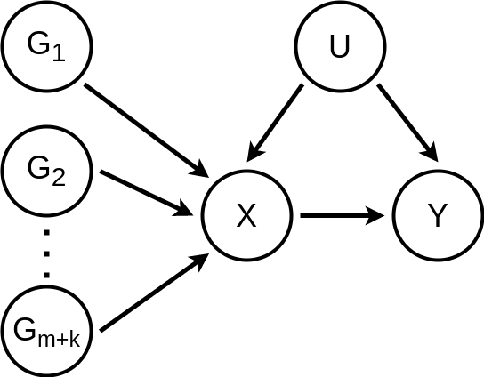

```{r, include = FALSE}
knitr::opts_chunk$set(
  collapse = TRUE,
  comment = "#>"
)
```

## Data generating process

Let

- $X$: Exposure
- $Y$: Outcome
- $U$: Confounder
- $G_i$ : Instrumental variable (SNP for the MR case)

Then, the assumed data generating process (DGP) is represented by the following DAG (directed acyclic graph)



and is defined by the following system of structural equations

$G_i = \dfrac{G'_i - 2 p}{\sqrt{2 p (1 - p)}};\; \text{ for } i = 1, \ldots, m + k$

$U = \alpha_U + \sigma_U \varepsilon_U$

$X = \alpha_X + \beta_{U \rightarrow X} U + \sum\limits_{i = 1}^{m + k} \beta_{G_i \rightarrow X} G_i + \sigma_X \varepsilon_X$

$Y = \alpha_Y + \beta_{U \rightarrow Y} U + \beta_{X \rightarrow Y} X + \sigma_Y \varepsilon_Y$

where

$G'_i \sim \text{Binomial}(2, p);\; \text{ for } i = 1, \ldots, m + k$

$\varepsilon_U \sim \text{Normal}(0, 1)$

$\varepsilon_X \sim \text{Normal}(0, 1)$

$\varepsilon_Y \sim \text{Normal}(0, 1)$

are assumed independent.

## Restrictions and hyper parameters

Now, by assuming all non-zero effect $G$'s to have the same effect

$\beta_{G_i \rightarrow X} = \beta_{G_j \rightarrow X};\; \forall i, j \leq m$

and enforcing the standardized variable restrictions

$\mathbb{E} G_i = \mathbb{E} U = \mathbb{E} X = \mathbb{E} Y = 0;\; \text{ for } i = 1, \ldots, m + k$

$\mathbb{V} G_i = \mathbb{V} U = \mathbb{V} X = \mathbb{V} Y = 1;\; \text{ for } i = 1, \ldots, m + k$

one can fully calculate the DGP's parameters with the following hyper parameters

- $d$ : Number of $G_i$'s
- $s$ : Proportion of zero effect $G_i$'s
- $p$ : Minor allele frequency of $G_i$'s
- $r_{G \rightarrow X}^2$ : Variance in $X$ explained per non-zero effect $G$
- $r_{U \rightarrow X}^2$ : Variance in $X$ explained by $U$
- $r_{U \rightarrow Y}^2$ : Variance in $Y$ explained by $U$
- $\beta_{X \rightarrow Y}$ : Causal effect of $X$ on $Y$

These hyper parameters are highly interpretable due to the following reasons

- Reasonable values for $d$ can be observed from real GWAS data
- Reasonable values for $s$ can be estimated from real GWAS data or simply accessed by checking multiple values in the $[0, 1]$ inteval
- Reasonable values for $p$ can be estimated from real GWAS data or simply accessed by checking multiple values in the $[0, 0.5]$ inteval
- Reasonable values for $r_{G \rightarrow X}^2$ can be estimated from real GWAS data or simply accessed by checking multiple values in the $[0, 1]$ inteval
- Reasonable values for $r_{U \rightarrow X}^2$ can be accessed by checking multiple values in the $[0, 1]$ inteval
- Reasonable values for $r_{U \rightarrow Y}^2$ can be accessed by checking multiple values in the $[0, 1]$ inteval
- $\beta_{X \rightarrow Y}$ is the target causal effect and can be accessed by checking multiple values in the $[-1, 1]$ inteval

## Parameters formulas

Given the hyper parameters and retriscitons, the parameters can be calculated as following

### SNPs

$m = \text{ceiling}((1 - s) \cdot d)$

$k = d - m$

$p = p$

### Intercepts

$\alpha_U = 0$

$\alpha_X = 0$

$\alpha_Y = 0$

### Effects

$\beta_{G_i \rightarrow X} = 1(i \leq m) \sqrt{r_{G \rightarrow X}^2}$

$\beta_{U \rightarrow X} = \sqrt{r_{U \rightarrow X}^2}$

$\beta_{X \rightarrow Y} = \beta_{X \rightarrow Y}$

$\beta_{U \rightarrow Y} = \sqrt{r_{U \rightarrow Y}^2} - \beta_{X \rightarrow Y} \beta_{U \rightarrow X}$

### Noise scales

$\sigma_U^2 = 1$

$\sigma_X^2 = 1 - \beta_{U \rightarrow X}^2 - \sum\limits_{i = 1}^{m + k} \beta_{G_i \rightarrow X}^2$

$\sigma_Y^2 = 1 - (\beta_{U \rightarrow Y} + \beta_{X \rightarrow Y} \beta_{U \rightarrow X})^2 - \beta_{X \rightarrow Y}^2 \sum\limits_{i = 1}^{m + k} \beta_{G_i \rightarrow X}^2 - \beta_{X \rightarrow Y}^2 \sigma_X^2$

## Implementation comments

- Technically, some coefficients could have their signs flipped and the relations would still be valid. For instance, $\beta_{U \rightarrow X} = - \sqrt{r_{U \rightarrow X}^2}$ would be a valid choice.
